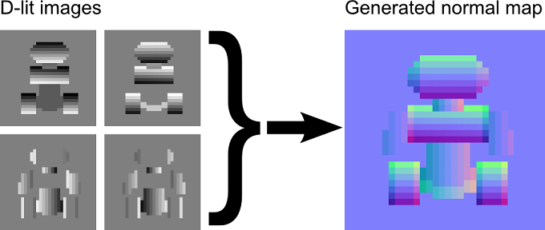
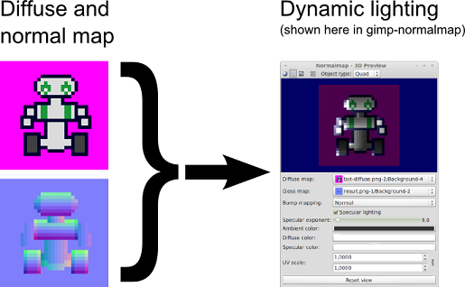
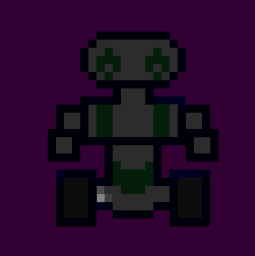

unflattener
===========

Unflattener is a free and open source Python module and a command line tool (`unflatten`) that helps you make normal maps for 2D sprites and other graphics. You can use the normal maps it generates to implement dynamic lighting in video games.

Example
=======

How it works
============

Unflattener takes as input images of your object lit by a light source pointing directly at that object from four directions: top, bottom, left and right (we'll call those images "directionally lit" or "d-lit" for short — like "d-pad"). At least one such image is required; having at least two (one with light coming from the top or the bottom, one with light from the left or the right) is highly recommended.

Unflattener is written in Python and requires the libraries [NumPy](http://www.numpy.org/) and [Pillow](https://python-pillow.org/) to work. Python programs can access its functionality directly by importing the `NormalMap` class from the module `unflattener.normalmapgen`. Right now Unflattener cannot do dynamic lighting previews, so you will need a third-party tool like the [gimp-normalmap](https://code.google.com/p/gimp-normalmap/) plugin for [GIMP](http://www.gimp.org/) for that.

This project was inspired by [Sprite Lamp](http://snakehillgames.com/spritelamp/).

The core algorithm is explained in a [rather lengthy comment](https://github.com/dbohdan/unflattener/blob/master/unflattener/normalmapgen.py#L65) in the method `NormalMap.create_from_images` in `normalmapgen.py`. You will find some tips on how the input artwork should look in the same comment.

The general idea is that in the d-lit images your object should look as if it were

1. Uniformly matte white with no self-shadowing;
2. Lit by a very distant light source much larger than itself that creates no highlights.

Installation
============

Unflattener has been tested to work under Linux (Ubuntu 12.04, Ubuntu 16.04, Fedora 26, Debian 7 and openSUSE Tumbleweed 2017*) and Windows (XP, 7, 8.1 and 10).

You will need Python 2.7 (v2.6 and earlier won't work) or Python 3.2 or later, NumPy and Pillow to run Unflattener. The following instructions are for Python 2.7.

Debian and Ubuntu
-----------------

You can install the dependencies from the distribution's package repository with

    sudo apt install git python-numpy python-imaging python-setuptools

To install gimp-normalmap, run

    sudo apt install gimp-normalmap

To install Unflattener, clone this repository, `cd` into it and run `setup.py`:

    git clone https://github.com/dbohdan/unflattener
    cd unflattener
    python setup.py install --user

Fedora
------

You can install the dependencies from the distribution's package repository with

    sudo dnf install git numpy python-pillow python-setuptools

To install gimp-normalmap, run

    sudo dnf install gimp-normalmap

To install Unflattener, clone this repository, `cd` into it and run `setup.py`:

    git clone https://github.com/dbohdan/unflattener
    cd unflattener
    sudo python setup.py install

Windows
-------

On Windows you first need to install Python 2.7 using the official installer from <http://python.org/download/>. Unflattener has only been tested with the 32-bit versions of Python, NumPy and Pillow (on both 32-bit and 64-bit Windows), so it is recommended that you use those.

Once you have Python installed, download the latest binary packages for NumPy and Pillow from <http://www.lfd.uci.edu/~gohlke/pythonlibs/>. They will be named, e.g., `numpy-1.13.1+mkl-cp27-cp27m-win32.whl` and `Pillow-4.2.1-cp27-cp27m-win32.whl`. Open the Command Prompt in the directory where you downloaded the package files and run

    c:\Python27\python.exe -m pip install "numpy-1.13.1+mkl-cp27-cp27m-win32.whl"
    c:\Python27\python.exe -m pip install Pillow-4.2.1-cp27-cp27m-win32.whl

To install Unflattener, clone this repository with [Git for Windows](https://git-scm.com/download/) or download <https://github.com/dbohdan/unflattener/archive/master.zip> and unzip it, `cd` into the created directory and do

    c:\Python27\python.exe setup.py install

You should then be able to run Unflattener from the Command Prompt with the command `unflatten`. If you don't have the Python 2.7 scripts directory added to your `%PATH%`, try

    c:\Python27\Scripts\unflatten.exe

Usage
=====

    usage: unflatten.py [-h] [--top TOP] [--bottom BOTTOM] [--left LEFT]
                        [--right RIGHT] [--output OUTPUT] [--depth DEPTH]

    Generate a normal map for 2D art

    optional arguments:
      -h, --help            show this help message and exit
      --top TOP, -t TOP     top image file
      --bottom BOTTOM, -b BOTTOM
                            bottom image file
      --left LEFT, -l LEFT  left image file
      --right RIGHT, -r RIGHT
                            right image file
      --output OUTPUT, -o OUTPUT
                            output file name
      --depth DEPTH, -d DEPTH
                            normal map z_N range

    One input file minimum, at least two (one for each axis) highly recommended.
    Input files should be 8-bit grayscale PNGs.

Submit your work
================

If you use Unflattener to create artwork or video game graphics, [file an issue](https://github.com/dbohdan/unflattener/issues) to have your work featured here.

License information
===================

Unflattener is distributed under the new (3-clause) BSD license. See the file `LICENSE`.

Robot sprite originally from the [Bits & Bots art pack](http://opengameart.org/content/bits-bots-art-pack) by MoikMellah. The sprite is licensed under the Creative Commons [CC0](http://creativecommons.org/publicdomain/zero/1.0/) license.
